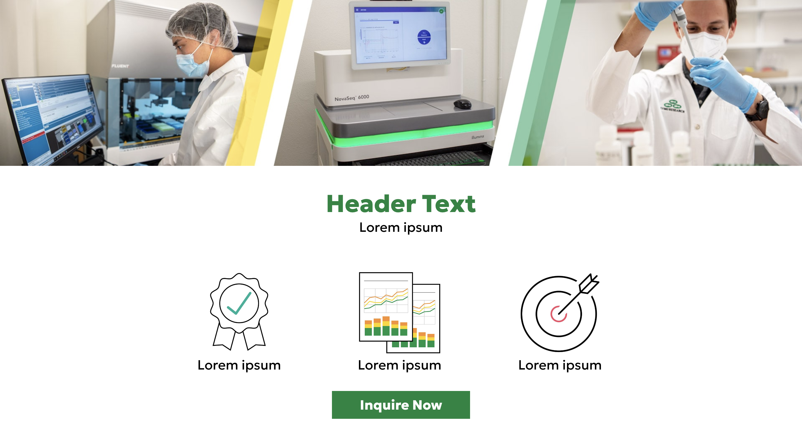
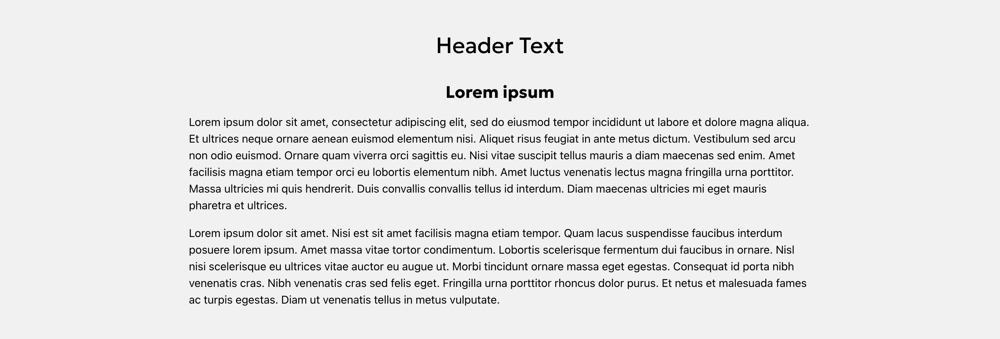
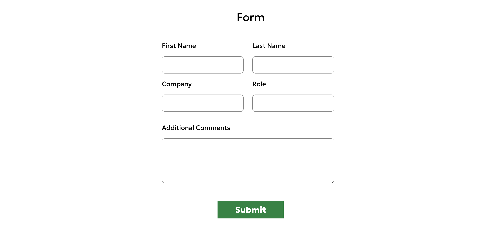

# Zymo Landing Page
## Description

This application is a responsive landing page that includes a header, hero section, and a contact form.
[https://nbtrieu.github.io/zymo-landing-page/](https://nbtrieu.github.io/zymo-landing-page/)

## Table of Content

* [Installation](#installation)

* [Usage](#usage)

* [Contributing](#contributing)

* [Questions](#questions)   

## Installation

To install all necessary dependencies for development purposes, please run the command below:  

``npm i``  

``npm run start``

## Usage

To use this application, open this link: [https://nbtrieu.github.io/zymo-landing-page/](https://nbtrieu.github.io/zymo-landing-page/). Then, scroll or click on the Inquire Now button to go straight to the contact form. At the form, fill out first name, last name, company, role and any additional comments, and click Submit.

 
  

  

  

## Contributing

There are many ways in which you can participate in this project.
Users can contribute to this repo by submitting bugs and feature requests, reviewing source code changes, and making pull requests for any issues they can find.    

## Questions

For any questions or feedback, please feel free to email me at nghi.nicole.trieu@gmail.com.
If you would like to check out more of my projects, please visit my repo at [/nbtrieu](https://github.com/nbtrieu).
